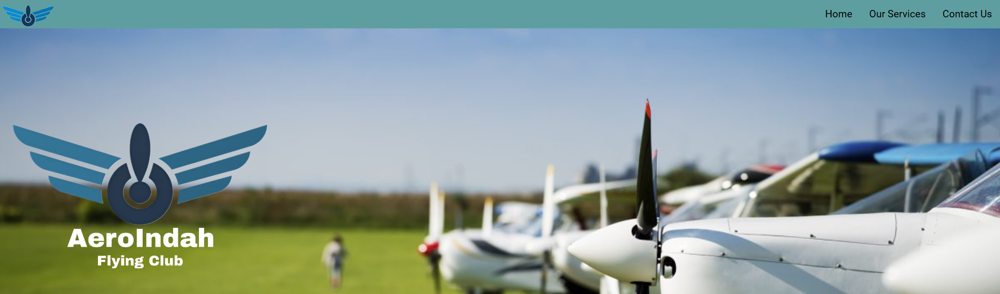

  

# <i><b>About This Project</b></i>
Hello everyone, my name is <b><i>Muhammad Rifqi Saleh</i></b> !    
As part of my software engineering course, i was tasked to make a simple website based of HTML and design it with CSS. This website consist of sticky Navbar, log in & enquiry form, Introduction paragraph and gallery preview. This projects presents a simple company profile of a flying club in Jakarta. The focus of this website is to provide basic explanation and introduction of the company.

Visit this link (https://aeroindahflyingclub.site/) to access my deployment !

  

 

## <i><b> Table of Contents </b></i>
<ul><li>Technologies Used</li>
<li>Features</li>
<li>Setup</li>
<li>Deployment</li></ul>

 

## <i><b> Technologies used </b></i>

`HTML 5` `CSS`

 

## <i><b> Features </b></i>  

<ul>
<li>Screen design that cater to all devices</li>
<li>Simple navigation bar</li>
<li>Company mission & programs</li>
<li>Company team member and fleet</li>
<li>Enquiry section</li> </ul>

 

## <i><b>Setup</b></i>  

1. Through your preferred terminal, clone the repository: 
    [`https://github.com/rifqisaleh/milestone1-rifqisaleh-.git`]

2. Navigate to the project directory: 
`cd milestone1-rifqisaleh`

3. Open the `index.html` file in your browser:
   
4. For accessing any pictures from "images" folder, you can use:  
 `

## <i><b> Deployment </b></i>  
In this section, i will explain my website deployment process. This sections are divided into 5 sections. Which includes:
1. Website/Tools Used
2. Deployment
3. Domain Registration

 
<li><b>Website/Tools Used</b> 
The tools/website that are used for this deployment are:
<ul>

[My Github Repo](https://github.com/rifqisaleh/milestone1-rifqisaleh-.git) 
[Netifly](https://www.netlify.com/)  
[Niagahoster](https://www.niagahoster.co.id/)

</ul>

 
<li><b>Deployment</b> 
 

- After signing in, i proceed to import my existing repository by clicking the "Import From Git" on my main netifly page.

- It will then lead to a page where i can choose to export my project from different git provider. In this case, i'll be using Repo from github. It will prompt to select a specific repo to deploy. 
  

- I chose "aeroindahflyingclub" as my site name. It will then check my preferred name availability. Within the same page, i then proceeds to deploy my project by clicking `Deploy aeroindahflyingclub`.
  

- It will then revert back to site overview, where i can observe the deployment progress. When the deployment are done, a success message popped up. 
 

<li><b>Domain Registration</b></li> 

- For this deployment, i will be using a local domain hosting, niagahoster.

- After log-in, i clicked `Miliki Domain Baru`, add my preferred site name and then purchase the preferred domain. Next, i set the site configuration and personal contact information.   

- If successful,the page then redirected to `Ringkasan Domain`, and then i need to configure the DNS name.   

- To set up the DNS name, i went back to netifly and on the Site Overview page, i chose `Set Up a Custom Domain`. I then add and verify my preferred site name (aeroindahflyingclub.site). Afterwards, i proceeds to `Add Domain`.

- The page then redirected to Domain Management, and just to the right of "aeroindahflyingclub.site", i click `option` and `Go To DNS Panel`.   

- I then copy the four domain's name server, and paste it on niagahoster name server. After saving the DNS name, I waited at least 30 minutes before i can finally access my website.

